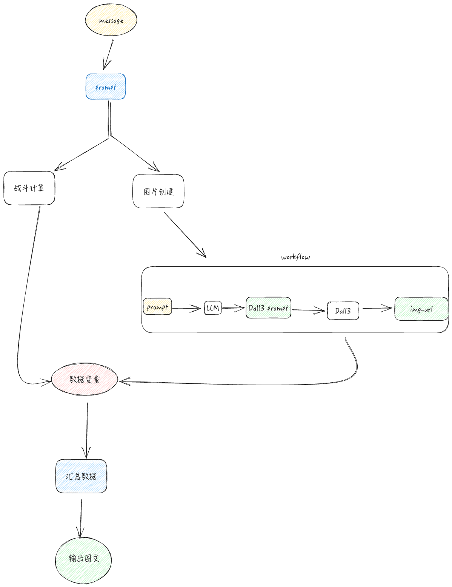
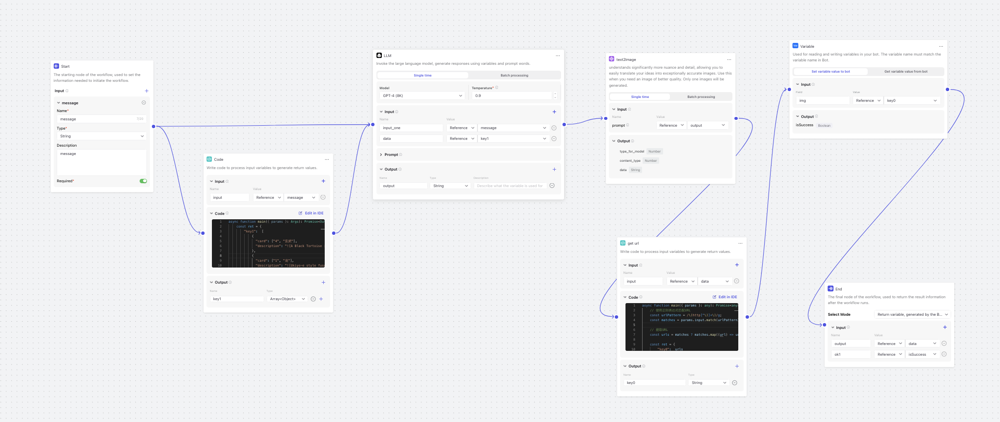

# gpt-game

游戏名称：《四象竞技》
游戏世界观：在一个古老的四象世界中，四大力量：青龙、白虎、朱雀、玄武，代表着1至4的四个数字。玩家需要扮演力量的使者，通过巧妙的策略，击败其他使者，成为最后的赢家。

## prompt 

[prompt](base.prompt.md)

## workflow 

## GPT  
- GPT-4 128k
- GPT-4 8K
- GPT-3.5 16k
- dall3

